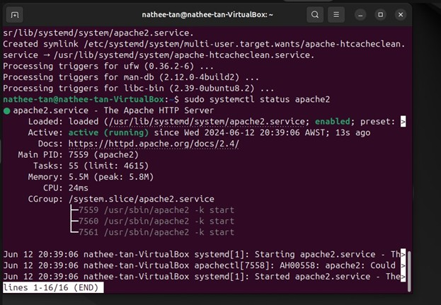
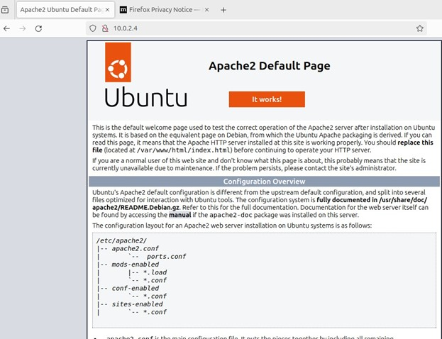
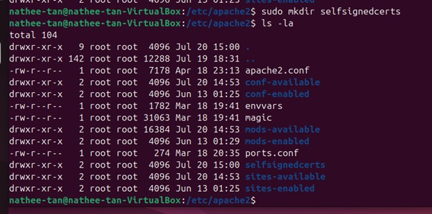
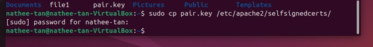
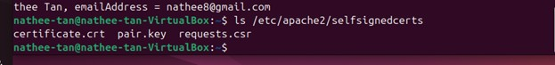
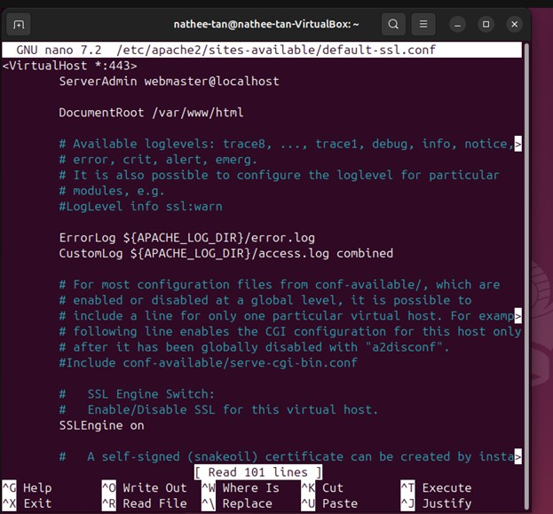
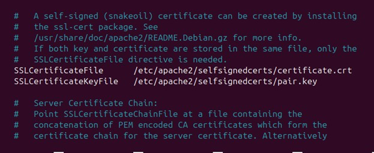
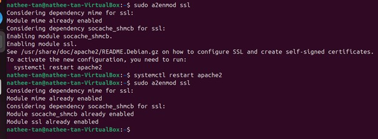
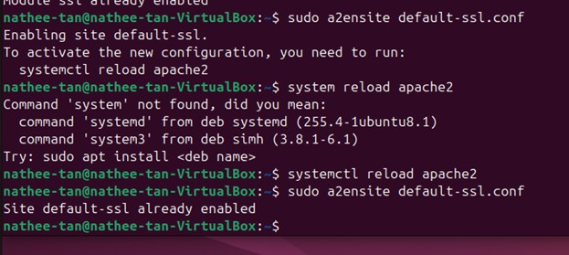
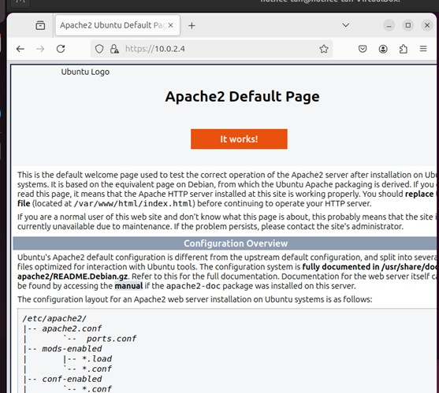

# Secure Apache Web Server Deployment & Hardening on Ubuntu

This project demonstrates the deployment, configuration, and hardening of an Apache web server on Ubuntu Linux.
It includes HTTPS configuration using a self‑signed SSL certificate, firewall rules, and multiple security hardening techniques.

This project is based on Lab 3.3 (Web Server & Firewall) and Lab 6.3 (PKI & Apache Hardening).

📌 Overview

The goal of this project is to deploy a functional Apache web server and secure it using HTTPS, firewall rules, and server hardening techniques.
This demonstrates practical skills in:

- Linux server administration
- Web server configuration
- SSL/TLS & PKI
- Firewall management
- Web security hardening
- Vulnerability scanning and validation

🛠️ Technologies Used

- Ubuntu Linux
- Apache2
- OpenSSL
- UFW Firewall
- ModSecurity (WAF)
- ModEvasive (Anti‑DDoS)
- Nmap (Kali Linux)

🌐 Architecture Diagram

```
Code
┌──────────────────────────────┐
│        Kali Linux (Scanner)  │
│   - Nmap scanning            │
│   - Security validation      │
└──────────────┬──────────────┘
               │
               │  HTTP / HTTPS
               ▼
┌──────────────────────────────┐
│      Ubuntu Web Server       │
│   Apache2 + SSL + Hardening  │
│   - Self-signed certificate  │
│   - UFW firewall rules       │
│   - ModSecurity WAF          │
│   - ModEvasive anti-DDoS     │
└──────────────────────────────┘
```

📁 Project Structure

```
Code
/apache-secure-server
│
├── README.md
├── configs/
│   ├── default-ssl.conf
│   ├── security.conf
│   └── apache2.conf
│
├── certs/
│   ├── certificate.crt
│   └── pair.key (private key not uploaded)
│
└── screenshots/
    ├── http-access.png
    ├── https-access.png
    ├── ufw-rules.png
    ├── nmap-before.png
    └── nmap-after.png
```

🚀 Implementation Steps

1. Apache Installation

```bash
sudo apt-get update
sudo apt-get upgrade
sudo apt-get install apache2
sudo systemctl status apache2
```



Test HTTP access (browser view):

Access the default Apache welcome page in a browser or with curl using:

http://localhost

http://SERVER_IP



2. UFW Firewall Configuration

```bash
sudo ufw enable
sudo ufw allow 80
sudo ufw allow 443
sudo ufw allow 3306
sudo ufw status numbered
```


To deny HTTP:

```bash
sudo ufw deny 80/tcp
```


3. Generate SSL Certificate (OpenSSL)

Generate RSA key pair

```bash
openssl genrsa -out pair.key
```


Create CSR

```bash
sudo openssl req -new -key pair.key -out request.csr
```


Self-sign certificate

```bash
sudo openssl x509 -req -days 365 -in request.csr -signkey pair.key -out certificate.crt
```


Move certs into Apache directory:

```bash
sudo mkdir /etc/apache2/selfsignedcerts
sudo cp pair.key /etc/apache2/selfsignedcerts/
sudo cp certificate.crt /etc/apache2/selfsignedcerts/
```







4. Enable HTTPS in Apache

Edit SSL config:

```bash
sudo nano /etc/apache2/sites-available/default-ssl.conf
```



Set:

```
SSLCertificateFile /etc/apache2/selfsignedcerts/certificate.crt
SSLCertificateKeyFile /etc/apache2/selfsignedcerts/pair.key
```



Enable SSL:

```bash
sudo a2enmod ssl
sudo a2ensite default-ssl.conf
sudo systemctl restart apache2
```





Test HTTPS:

```
https://SERVER_IP
```


5. Apache Hardening

Edit security configuration:

```bash
sudo nano /etc/apache2/conf-enabled/security.conf
```

Set:

```
ServerSignature Off
ServerTokens Prod
TraceEnable Off
```

Restart:

```bash
sudo systemctl restart apache2
```

6. Install ModSecurity (WAF)

```bash
sudo apt-get install libapache2-mod-security2 -y
sudo systemctl restart apache2
```

7. Install ModEvasive (Anti‑DDoS)

```bash
sudo apt-get install libapache2-mod-evasive -y
sudo systemctl restart apache2
```

🔍 Security Validation (Nmap)

Before Hardening

Apache version & OS details were visible:

```
{
