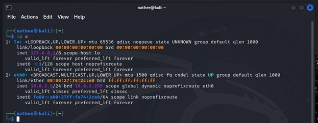

# Packet Capture and Network Traffic Analysis

## Overview

This project demonstrates the configuration of a VirtualBox home lab to capture and analyse network traffic using both Linux and Windows operating systems. Network interfaces were configured, connectivity between virtual machines was verified, and traffic was captured using **tcpdump** and **Wireshark** to develop practical packet analysis and troubleshooting skills.

---

## Objectives

The objectives of this project were to:

- Configure network settings in Linux and Windows.
- Explore network interfaces and IP configuration.
- Capture network traffic using **tcpdump**.
- Analyse captured packets using **Wireshark**.
- Develop a practical understanding of packet capture and network troubleshooting.

---

## Lab Environment

### Hypervisor

- Oracle VirtualBox

### Operating Systems

- Kali Linux
- Windows 10
- Ubuntu

### Tools Used

- Linux Terminal
- Windows PowerShell
- tcpdump
- Wireshark

---

## Part 1 – Network Configuration in Linux

Linux networking commands were used to explore the system's network configuration and verify communication between virtual machines.

### Viewing Network Interfaces

The `ip a` command was used to identify available network interfaces, including assigned IP addresses, MAC addresses and subnet information. This information was used to determine the active network adapter for packet capture.



---

### Hostname Resolution

The `/etc/hosts` file was modified to create a local hostname entry for the Windows virtual machine. This allowed communication using a hostname rather than an IP address, demonstrating how local hostname resolution functions within Linux.

---

### Connectivity Testing

Connectivity between the Kali Linux and Windows virtual machines was verified using ICMP echo requests (`ping`). Successful replies confirmed that hostname resolution and network communication were functioning correctly.

---

## Part 2 – Network Configuration in Windows

Windows networking tools were used to examine network adapter settings and configure DNS using PowerShell.

### Network Adapter Configuration

The `ncpa.cpl` utility was used to review the IPv4 configuration of the active network adapter. Windows PowerShell and the `netsh` command were then used to configure a static DNS server, demonstrating an alternative method of managing network settings through the command line.

---

## Part 3 – Capturing Traffic with tcpdump

Traffic capture was performed using **tcpdump** within the Kali Linux virtual machine.

### Listing Network Interfaces

Available capture interfaces were identified using:

```bash
tcpdump -D
```

This confirmed the available interfaces prior to beginning packet capture.

---

### Capturing Network Traffic

Traffic was captured on individual interfaces and across all interfaces using various tcpdump options.

Commands used included:

```bash
tcpdump -i eth0
```

```bash
tcpdump -i any
```

```bash
tcpdump -i any -c 5
```

These captures demonstrated how tcpdump can monitor live network traffic and limit captures to specific numbers of packets.

---

### Filtering Traffic

Traffic filtering was performed using host-based filters to isolate communications from specific devices.

Example:

```bash
tcpdump -i any host <IP_Address>
```

Additional filtering techniques using source, destination and logical operators were explored to reduce unnecessary traffic and focus packet analysis.

---

## Part 4 – Packet Analysis with Wireshark

Captured traffic was examined using Wireshark to better understand network communications between virtual machines.

Packet analysis included identifying common protocols such as:

- **ICMP** (Internet Control Message Protocol)
- **DNS** (Domain Name System)
- **TCP** (Transmission Control Protocol)

Wireshark provided detailed packet information including source and destination addresses, protocol types and packet contents, demonstrating how captured traffic can be analysed during network troubleshooting.

---

## Skills Demonstrated

- Linux network configuration
- Windows network configuration
- Packet capture techniques
- Packet filtering and analysis
- Wireshark packet analysis
- Network troubleshooting
- TCP/IP fundamentals
- DNS configuration
- Linux command-line administration
- Virtual machine networking

---

## Key Takeaways

This project provided practical experience configuring virtual machine networking, capturing live traffic and analysing network packets using industry-standard tools. Working with both **tcpdump** and **Wireshark** strengthened my understanding of packet capture techniques, protocol analysis and troubleshooting methods commonly used in IT support and cybersecurity environments.

The ability to capture and analyze network traffic is fundamental to network security, incident response, and troubleshooting—critical skills for any cybersecurity professional.